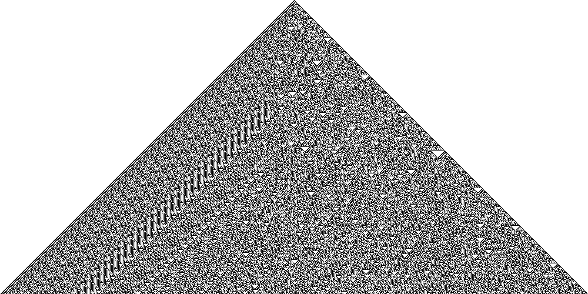

# Elementary cellular automata

I implemented the [Rule 30](https://en.wikipedia.org/wiki/Rule_30) for an elementary cellular automata.

The program can generate a visualization of the plan. Example for the Rule 30 :   

## Roadmap
Things to do to go further with this project :
- Create an interface for rules 
- Add others rules