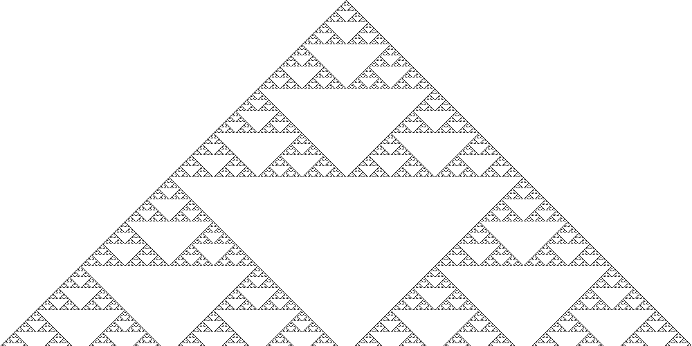

# Elementary cellular automata

I implemented the [Rule 30](https://en.wikipedia.org/wiki/Rule_30) for an elementary cellular automata.

The program can generate a visualization of the plan. Example for the Rule 30 :   

Here is the rule 90, generating a [Sierpinski triangle](https://en.wikipedia.org/wiki/Sierpi%C5%84ski_triangle) :

## Roadmap
Things to do to go further with this project :
- Create an interface for rules 
- Add others rules

- Add it as a web service so a front-end can give a nice in-browser rendering: 
    - The web service is simply a controller that receives the parameter for the cellular automata (number of cells per row, number of rows/iterations, and the rule). It will return a JSON response containing the representation of the plan generated.

- Make the front-end to render the plan with some JavaScript (frameworks to consider : D3.js, processing, P5.js, ...)